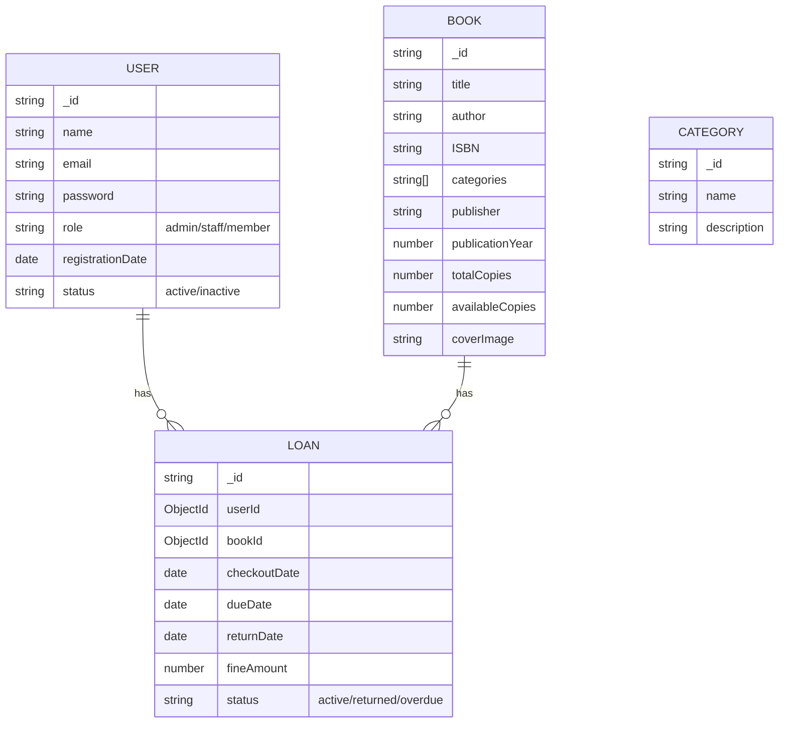

# Library Management System - MERN Stack


[](https://www.mongodb.com/)
[](https://expressjs.com/)
[](https://reactjs.org/)
[](https://nodejs.org/)
[](https://opensource.org/licenses/MIT)
[](https://github.com/bhabinexpert/Library-Management-System/stargazers)
[](https://github.com/bhabinexpert/Library-Management-System/issues)

A modern, full-stack Library Management System built with the MERN stack (MongoDB, Express, React, Node.js) that simplifies library operations, enhances user experience, and provides comprehensive administrative control.

## ✨ Key Features

- **📚 Book Management** - Add, update, delete, and search books
- **👥 User Management** - Admin/Librarian and Member roles with granular permissions
- **🔄 Book Circulation** - Intuitive check-in/check-out system with due date tracking
- **⏰ Automated Reminders** - Email notifications for due dates and reservations
- **📊 Analytics Dashboard** - Visualize library usage with interactive charts
- **🔍 Advanced Search** - Filter books by title, author, category, ISBN, or status
- **🔒 Secure Authentication** - JWT-based authentication with role-based access
- **📱 Responsive Design** - Optimized for desktop, tablet, and mobile devices
- **💸 Fine Management** - Automatic calculation of late return fees
- **📈 Reporting System** - Generate PDF reports for inventory, transactions, and users

## 🚀 Technology Stack

### Frontend
[](https://reactjs.org/)
[](https://redux-toolkit.js.org/)
[](https://mui.com/)
[](https://reactrouter.com/)
[](https://axios-http.com/)


### Backend
[](https://nodejs.org/)
[](https://expressjs.com/)
[](https://www.mongodb.com/)
[](https://mongoosejs.com/)
[](https://jwt.io/)


### Development Tools
[](https://git-scm.com/)
[](https://code.visualstudio.com/)
[](https://www.postman.com/)
[](https://eslint.org/)
[](https://prettier.io/)


## 🛠️ Installation Guide

### Prerequisites
- Node.js (v16.x or higher)
- MongoDB (v6.x or higher)
- NPM (v8.x or higher)

### Setup Instructions

1. **Clone the repository:**
   ```bash
   git clone https://github.com/bhabinexpert/Library-Management-System.git
   cd Library-Management-System
   ```

2. **Install server dependencies:**
   ```bash
   cd server
   npm install
   ```

3. **Install client dependencies:**
   ```bash
   cd ../client
   npm install
   ```

4. **Configure environment variables:**
   Create a `.env` file in the `server` directory with the following content:
   ```env
   PORT=5000
   MONGODB_URI=mongodb://localhost:27017/library_db
   JWT_SECRET=your_secure_jwt_secret
   JWT_EXPIRES_IN=30d
   SMTP_HOST=smtp.example.com
   SMTP_PORT=587
   SMTP_USER=your_email@example.com
   SMTP_PASS=your_email_password
   FRONTEND_URL=http://localhost:3000
   ```

5. **Initialize the database:**
   Start MongoDB service and seed initial data (optional):
   ```bash
   cd server
   npm run seed
   ```

6. **Start the application:**
   - Start backend server:
     ```bash
     cd server
     npm run dev
     ```
   - Start frontend development server:
     ```bash
     cd client
     npm start
     ```

7. **Access the application:**
   - Frontend: http://localhost:3000
   - Backend API: http://localhost:5000/api
   - Admin credentials (seed data): admin@library.com / admin123

## 🌐 Usage Guide

### User Roles

1. **Admin/Librarian:**
   - Full system access
   - Manage books, users, and categories
   - Process book loans and returns
   - Generate reports and view analytics
   - Configure system settings

2. **Library Staff:**
   - Manage book inventory
   - Process loans and returns
   - View member information
   - Generate basic reports

3. **Members:**
   - Browse and search books
   - View book availability
   - Checkout books (when logged in)
   - View personal loan history
   - Update personal profile

### Core Functionalities

- **📚 Book Management:**
  - Add new books with cover images
  - Update book details and availability
  - Categorize books by genres/subjects
  - Track copies and availability status

- **🔄 Loan Management:**
  - Checkout books with due dates
  - Renew loans (if eligible)
  - Return books with fine calculation
  - Reserve books that are currently checked out

- **📊 Reporting:**
  - Generate inventory reports
  - View loan statistics
  - Track popular books
  - Export reports in PDF/CSV formats

- **🔔 Notifications:**
  - Due date reminders (email)
  - Reservation availability alerts
  - Fine notifications
  - System announcements

## 📊 Database Schema



## 🤝 Contribution Guidelines

We welcome contributions! Please follow these steps:

1. **Fork the repository**
2. **Create a feature branch:**
   ```bash
   git checkout -b feature/your-feature-name
   ```
3. **Commit your changes:**
   ```bash
   git commit -m "Add: your meaningful commit message"
   ```
4. **Push to your branch:**
   ```bash
   git push origin feature/your-feature-name
   ```
5. **Create a Pull Request**

### Development Guidelines
- Follow existing code style and patterns
- Write meaningful commit messages
- Add appropriate comments for complex logic
- Update documentation when adding new features
- Test your code thoroughly before submitting

### Reporting Issues
Please use the [GitHub Issues](https://github.com/bhabinexpert/Library-Management-System/issues) page to report bugs or suggest enhancements.

## 📜 License

This project is licensed under the MIT License - see the [LICENSE](LICENSE) file for details.

## ✉️ Contact

**Project Maintainer:** [Bhabin Expert](https://github.com/bhabinexpert)  
**Email:** bhabindulal35@example.com  
**Project Link:** [https://github.com/bhabinexpert/Library-Management-System](https://github.com/bhabinexpert/Library-Management-System)

## 🙏 Acknowledgments

- [MERN Stack Documentation](https://www.mongodb.com/mern-stack)
- [React Community](https://reactjs.org/community/support.html)
- [Material UI Documentation](https://mui.com/)
- [Express Best Practices](https://expressjs.com/en/advanced/best-practice-performance.html)
- [Mongoose Documentation](https://mongoosejs.com/docs/guide.html)

---

**Ready to transform your library management?** ⭐ Star the repository if you find this project useful!  
**Found a bug?** 🐛 Please open an issue on our [GitHub Issues](https://github.com/bhabinexpert/Library-Management-System/issues) page.
